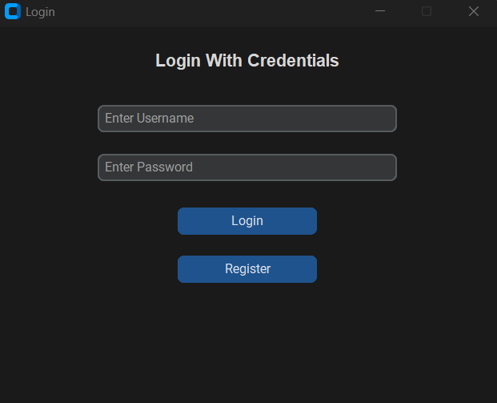
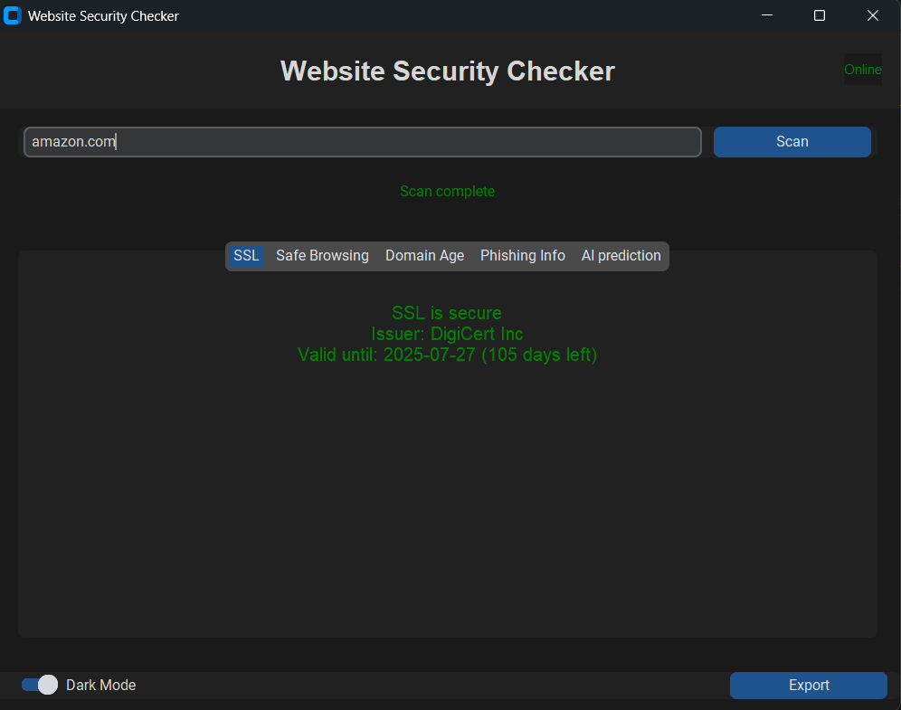
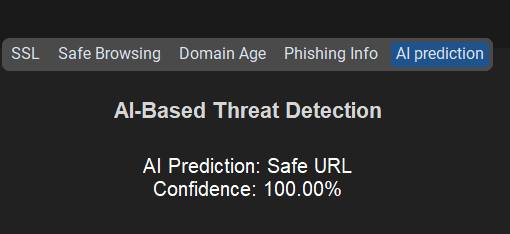

# 🔐 AI Website Security Checker

An AI-powered desktop application that detects whether a website URL is safe or malicious using machine learning and real-time security analysis.

---

## 🚀 Features

* 🔍 AI-based phishing detection using TF-IDF + Machine Learning
* 🔐 SSL Certificate verification
* 🌐 Google Safe Browsing API integration
* 📅 Domain age analysis using WHOIS
* 🖥️ Interactive GUI built with CustomTkinter
* 👤 Login & Registration system

---

## 🧠 How It Works

1. User enters a website URL
2. URL is converted into numerical features using TF-IDF vectorization
3. Machine learning model predicts whether the URL is safe or malicious
4. Additional checks (SSL, domain age, Safe Browsing) enhance the result

---

## 📸 Application Preview

### 🔐 Login Page



### 🔍 URL Scanner Interface



### 🤖 AI Prediction Result



---

## 🧰 Tech Stack

* Python
* Scikit-learn
* Pandas
* CustomTkinter
* Requests
* WHOIS
* Joblib

---

## ⚙️ Installation & Run

```bash
git clone https://github.com/Anujeet22/website-security-checker.git
cd website-security-checker
pip install -r requirements.txt
python Login.py
```

---

## 📊 Example Output

* ✅ Safe URL → Confidence ~85–95%
* ⚠️ Risky URL → Risk Score ~70–95%

---

## 📌 Future Improvements

* MySQL database integration
* Password hashing (bcrypt)
* Advanced feature-based phishing detection
* Web-based deployment

---

## 👨‍💻 Author

**Anujeet Kadam**
MCA Student | AI & Data Enthusiast

---

## ⭐ Support

If you found this project useful, consider giving it a ⭐ on GitHub!
